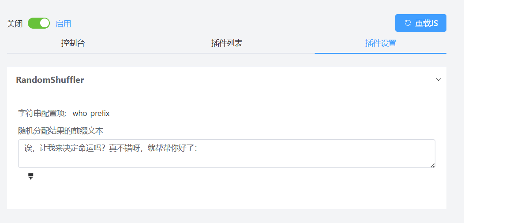

# Random Shuffler

一个用于随机打乱参数顺序的骰子指令脚本。

## 功能

- 改进海豹骰原有的`who`指令，增加对@对象的支持
- 使用 Fisher-Yates 洗牌算法确保公平随机
- **支持自定义排序结果前缀文本**
## 安装

1. 将dist文件夹中的random-shuffler.js下载
2. 在骰子的JS拓展中上传插件
3. 重载JS

## 🎮 使用说明  
### 基础语法  
```
.who 选项1 选项2 选项3...
```
#### 或
```
.who @用户1 @用户2 @用户3...
```

### 示例输入：
```
.who A B C D
```

### 可能输出：
```
交给我来分配吗？我明白了：
C
A
D
B
```

### 修改配置
在海豹骰界面的插件设置可自定义结果的前缀文本

## 技术细节

- 使用 Fisher-Yates 洗牌算法实现公平随机
- 支持通过 `.who` 命令调用

## 开发者

- 作者：zaozao
- 版本：1.1.5
- 许可证：Apache-2

## 更新日志

- v1.1.5: 初始发布版本
- v1.1.6：添加自定义配置